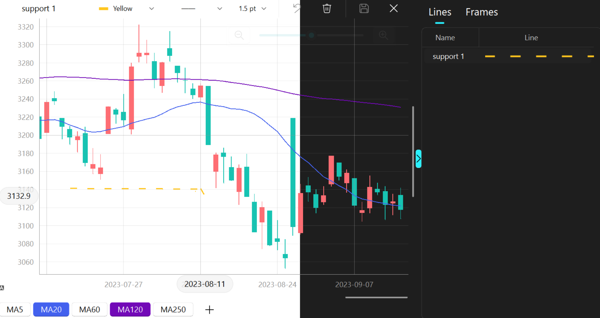

# QStockPlotter

A PyQt-based plotter for stock data



------

## Feature

* Multi-zoom models.

* Custom line drawing.

* Frame recording.

* Moving averaging line supported.

* Dark model and theme color supported (Powered by  [QFluntWidgets](https://qfluentwidgets.com/)).

## Quick Start

### Installation

```bash
python3 setup.py sdist bdist_wheel
cd dist
pip install qstock_plotter-*.whl
```

### Invoke the plotter

The following codes showcase how to invoke the default plotter to display a candlestick chart for a local stock data.

```python
from qstock_plotter import QStockPlotter
from qstock_plotter.libs.data_handler import *
from qstock_plotter.libs.plot_item import *
from PyQt6.QtWidgets import QApplication
from qfluentwidgets import setTheme,setThemeColor,Theme
import sys

app = QApplication(sys.argv)
app.setApplicationName("QStockPlotter")
sample_stock_data=HandlerCandlestickHDF5("./sample_stock_data.h5")
graph_item=get_plot_item(sample_stock_data.day_data.prices) 
#graph_item=get_plot_item(sh35.day_data.volume) #for volume
widget=QStockPlotter()
widget.show()
widget.add_main_item(graph_item,x_ticks=graph_item.get_x_ticks())
#widget.main_plotter.update_plot(x_loc=widget.main_plotter.x_end-5, x_range=5) # move to the end
#setTheme(Theme.DARK) #switch to dark theme
#setThemeColor("#0065d5") #change the theme color
sys.exit(app.exec())
```

### Modify the plotter

The default `QStockPlotter` is built on a series of function components. Each component is independent and provides certain functions. Currently, there are four components:

* `average_line`: A component that handles adding and removing average lines on a plot.
* `draw_line`: A component for drawing lines on a plot widget.
* `frame_recorder`: A component for recording and managing frames in a plot widget.
* `zoom_move`: A component provides scrollers and a zoom control widget for a plot widget

All the components are located in the `component` folder. These components provide different functions for a basic plotter, which should be an instance of `QPlotWidget`. `QPlotWidget` is a subclass of `PlotWidget` from [PyQtGraph](https://www.pyqtgraph.org/), offering basic plot functions with different zoom models. By developing and integrating the components for the `QPlotWidget`, users can build different complex widgets for different applications. Please refer to the  [source code](https://github.com/qiauil/QStockPlotter/blob/main/qstock_plotter/__init__.py) of `QStockPlotter` to see how these components work with `QPlotWidget`.

### Add more plot item

Since the basis `QPlotWidget` is a subclass of PyQtGraph's PlotWidget, any `GraphicsObject` from PyQtGraph should work for the QPlotWidget. However, to utilize the zoom functions of the `QPlotWidget`, we design a subclass of `GraphicsObject`, `AdaptiveGraphObject`.  Currently, we offer two `AdaptiveGraphObject`s  in the package: ``CandlestickPricesItem` and `CandlestickVolumeItem`. Users can design more `AdaptiveGraphObject` for their own needs. More details can be found in `libs/plot_item`.

We also introduce the concepts of `DataHandler` and `DataFrame` to build a bridge between raw data and plot items. `DataHandler` is designed to read data from files, e.g., the sample stock data or the internet, and convert the raw data into `DataFrame`, which will later be used by different plot items. More details can be found in `libs/data_hanlder`.

------

### Acknowledgement

This project is built based on a series of open-source projects, especially the [PyQtGraph](https://www.pyqtgraph.org/) and  [QFluntWidgets](https://qfluentwidgets.com/).